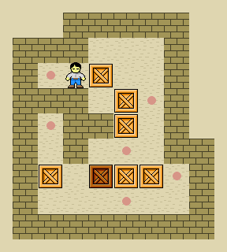

# TutorialPuzzleGame
Let's make a puzzle game to learn java principles!

## The Goal

High-Level
- Player should be able to push boxes by moving into them
- Game should be won if the player moves all the boxes onto the goals

Low-Level
- Code should not repeat itself and should make use of classes and methods

## Instructions
- put stuff here

## How to run the game
- Go to the tab that says Gradle on the upper right sidebar in IntelliJ
- Open the list labelled "desktop", it should be at the bottom
- Open the list labelled "Run Configurations"
- Double click the configuration labelled "Sokoban:desktop [run]"

### New Terminology Involved
- LWJGL: Lightweight Java Game Library
- gdx: The game engine we are using

### Files
- **/build.gradle**
  - This is the file that contains the script that manages compiling the code
- **/assets**
  - This is the folder that holds the assets
- **/core**
  - This is where the built in starter code goes [write more later pls]
- **/core/TutorialPuzzleGame.java** *[You code here!]*
  - This is the main class of the project
    - Your code branches out from here
  - If this were a robotics project this would be Robot.java
- **/core/solution** *[You code here!]*
  - This is where your code goes!
  - You can write subsystems here, etc

